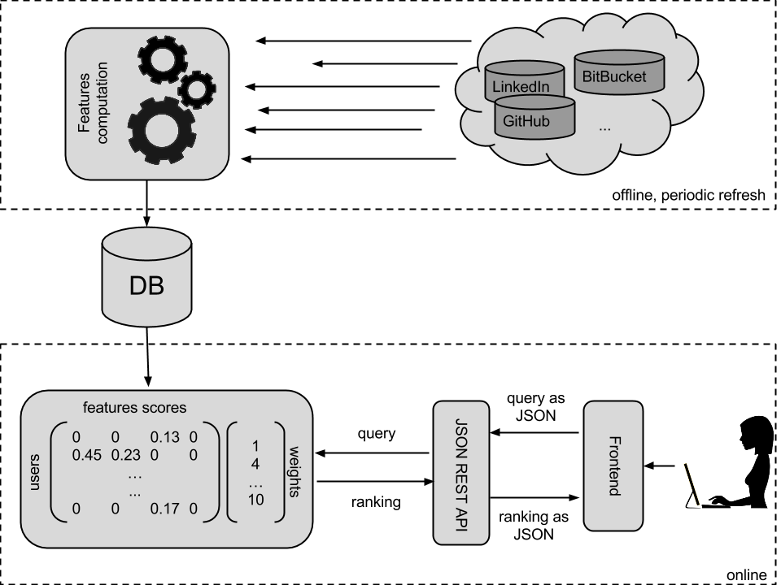

## About

This project is about establishing a complete profile of developers based on
their open-source contributions.

Creating a service to allow people, typically recruiters from companies or some
open-source projects, to search for a developer with a specific set of skills
and that the service outputs a list of developers ranked by best match with a
detailed profile accessible for each of them is the main project goal.

## More details about the project

This project, proposed by [Robin Hahling](https://github.com/Rolinh), started as
a project for a [Big Data class](http://data.epfl.ch/bigdatacourse) given at
[EPFL](http://epfl.ch/) for the master of science in computer science.

The main goal is to build a database of developers, along with an evaluation of
their programming skills, and make it available through a freely accessible API.
This database could then be used by recruiters for companies or members of open
source projects to find developers with the specific skills set they are looking
for. The [devmine-web](https://github.com/DevMine/devmine-web) project is a web
front-end that accesses this API.

Data used is first collected from [GitHub](https://github.com/) but other data
source will be considered later on ([BitBucket](https://bitbucket.org/),
[SourceForce](http://sourceforge.net/), [Gitorious](https://gitorious.org/),
...) and maybe even data collected from other kind of data source such as user
reputation from [StackOverflow](http://stackoverflow.com/), academic background
from [LinkedIn](https://www.linkedin.com/) and so on.

The main idea behind this project is that someone's contributions to open-source
projects can be a valuable source of information for recruiters. A website that
could highlight the skills of a developer, in a relatively good manner, by not
taking into consideration only his academic formation or past employers but also
actual code contributions and interactions within open-source communities would
probably reveal being valuable source of information.

## Project structure

The project is divided into two main parts: the offline and the online part.
The offline part is responsible of computing features and it is implemented in
the [devmine-features](https://github.com/DevMine/devmine-features) repository.
The online part provides the API and lays in the `devmine` module from this
repository.

On the offline part, each developers gets assigned a score for each feature,
which value is normalized between 0 and 1.  There are two different kind of
features: the primitive features and the derived features. Primitive features
can be used straight from the data source or require minimal processing, for
instance: lines of code in language X, number of GitHub followers, whether the
developer is available for hiring and so on.  Derived features typically require
some calculation. For instance, reputation of the developer determined by the
PageRank algorithm run with followers/following developers from GitHub as links
or HITS with developers as authorities and projects as hubs and so on. Each
feature defines a function to compute it and a function to normalize it and is
highly dependent on the available data sources.

On the online part, queries can be split into two parts: ranking and filtering.
The ranking part can be viewed as the definition of the "perfect developer", or
an assignment of weight to certain features. More precisely, a search query
consists of a set a feature names with associated weights provided by the user
that sends the query through a frontend (typically the web frontend).
Ranking is computed as a dot product between the scores matrix and the
weight vector. The scores matrix is a matrix, preloaded into memory, which
contains the developers as row and the features as column so each matrix cell
correspond to the score of a developer for a particular feature. The weight
vector is prefilled with default values for each feature but is modified
according to the user query prior the dot production computation, which
determines the ranking. Therefore, every single feature is taken into account to
determine the ranking but only there weight differ.
Filtering is used to specify attributes that developers must or must not have
such as living in Switzerland, being fluent in Java or available for hiring.

The composition function, ie the dot product between the scores matrix and the
weight vector, is used for the ranking. Once the ranking is established, results
are filtered out by the filtering function.

## Contribute

This project uses mainly `python` in version 3.
The easiest way to have every required libraries is to use a virtual
environment:

* Install `virtualenv` if necessary.
* Set up a virtual environment: `virtualenv -p python env` (replace `python`
  with `python3` if `python 3` is not your default `python` version).
* Activate it: `source env/bin/activate`.
* Install the required libraries using `pip`:
  `pip install -r requirements.txt`
* When contributing to the project, you also need to install development
  requirements:
  `pip install -r requirements_dev.txt`
* Install a server backend. This should be corresponding to what you configure
  in the settings. Default is `tornado`:
  `pip install tornado`
* For a basic setup, run the following command:
  `invoke setup`
* If you do not need to tweak anything, simply run the application:
  `python run.py`

When contributing, make sure that your changes are conform to PEP8 by running
`invoke pep8`. You may also want to do a static analysis of the code:
`invoke pyflakes`. To run a full check (both PEP8 and static analysis), run:
`invoke check`
